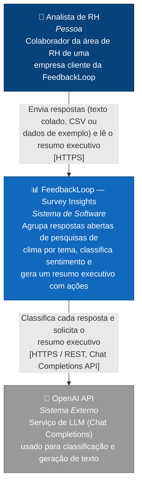

# C4 — Nível 1: Diagrama de Contexto

Mostra o sistema FeedbackLoop na sua fronteira mais ampla: quem usa e com quem ele conversa fora dela.

## Elementos

| Elemento | Tipo | Descrição |
|---|---|---|
| Analista de RH | Pessoa | Usuário final. Acessa a URL pública pelo navegador; não precisa de conta nem instalação local. |
| FeedbackLoop — Survey Insights | Sistema de software (o sistema em construção) | Aplicação web que recebe respostas abertas e devolve um resumo executivo com temas, sentimento e ações recomendadas. |
| OpenAI API | Sistema externo | Único sistema externo do qual o FeedbackLoop depende para funcionar. Recebe o texto das respostas — ver [auditoria](../auditoria-prototipo.md) sobre a lacuna de anonimização antes do envio. |

## Fora do diagrama, por decisão consciente

Não há sistema de autenticação, banco de dados externo, fila de mensagens ou sistema de billing nesta versão — o protótipo é intencionalmente de sessão única, sem persistência (ver [auditoria do protótipo](../auditoria-prototipo.md), seção 2.5). O diagrama reflete o sistema real, não um estado futuro aspiracional.
