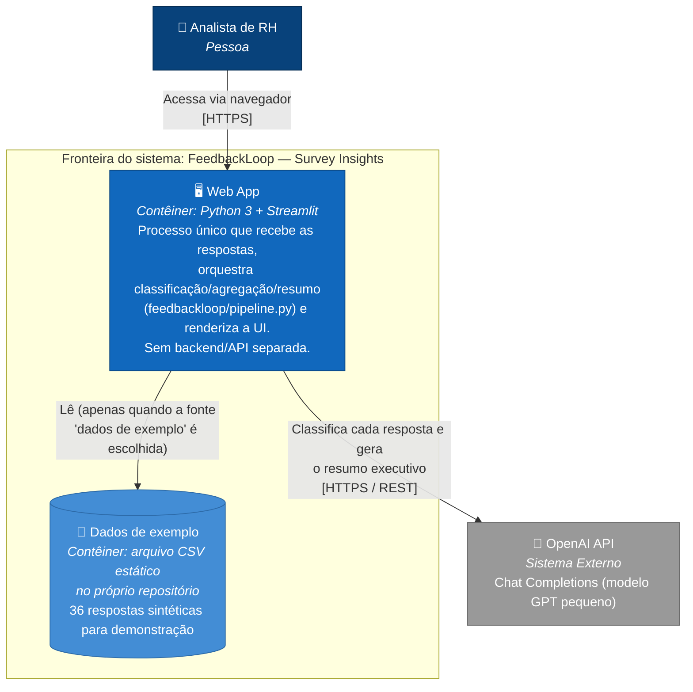

# C4 — Nível 2: Diagrama de Contêineres

Abre o sistema FeedbackLoop (a caixa azul do Nível 1) e mostra as partes que o compõem — no nosso caso, deliberadamente poucas: é um monólito de um único processo.

## Elementos

| Contêiner | Tecnologia | Responsabilidade |
|---|---|---|
| Web App | Python 3, Streamlit, `pandas` | Único deployable do sistema. Contém a UI (`app.py`) e a lógica de negócio (`feedbackloop/pipeline.py`, `feedbackloop/llm.py`) no mesmo processo. Hospedado como Web Service no Render (ver [ADR-002](../adr/0002-plataforma-de-deploy.md)). |
| Dados de exemplo | CSV versionado em Git | Não é um banco de dados: é um arquivo estático embutido no próprio contêiner de deploy, usado só para demonstração. Não guarda nenhum resultado gerado pelo usuário. |

## Por que não há mais contêineres

Não existe API separada, banco de dados, cache (Redis) ou fila nesta versão — e o diagrama não inventa nenhum para "parecer mais robusto". Streamlit acopla UI e lógica no mesmo processo por design; separar isso em contêineres distintos (ex.: API FastAPI + frontend) seria reescrever a arquitetura, o que contraria a regra da disciplina de evoluir o protótipo herdado. Se a Semana 9 do roadmap (persistência das análises) avançar, este diagrama ganha um novo contêiner de banco de dados e uma nova ADR — não antes disso.

## Mapeamento para o C4 Nível 1

A caixa "FeedbackLoop — Survey Insights" do [diagrama de contexto](c4-nivel1-contexto.md) corresponde exatamente ao contêiner "Web App" aqui — não há nenhuma parte do sistema que fique de fora da fronteira nos dois níveis.
